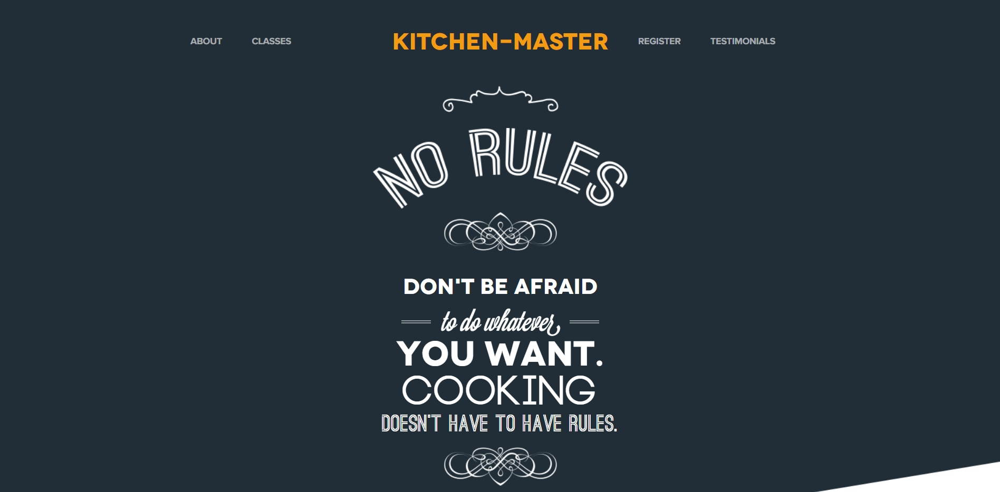

# kitchen-master
Ссылка: https://alexaltrex.github.io/kitchen-master

## Описание
Верстка одностраничного сайта.

## Запуск проекта:
1. Клонирование и запуск: git clone https://github.com/Alexaltrex/kitchen-master.git;
2. Переход в директорию с проектом: cd kitchen-master;
3. Запуск файла index.html;

## Цель проекта
* Изучение верстки и стилизации;

## Разработка
* Верстка - предпроцессор SASS (конкретно SCSS);

